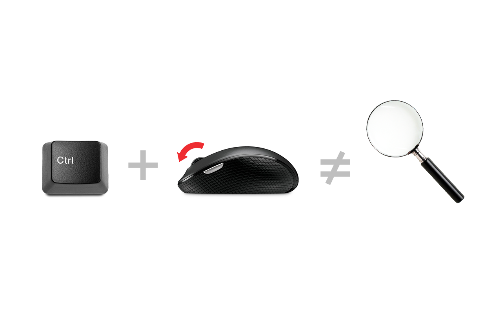

### Disable Ctrl + Scroll Wheel Zoom 🚫 🔍

Disables the ctrl + scroll wheel zoom shortcut in Chrome.

You can try out the extension on the [Chrome Web Store](https://chromewebstore.google.com/detail/mdpfkohgfpidohkakdbpmnngaocglmhl?hl=en&authuser=1). 
 

#### Description

This Chrome extension disables the Ctrl + scroll wheel zoom shortcut, preventing accidental zooming when browsing. It intercepts the wheel event and checks if the Ctrl key is pressed. If so, it prevents the default browser behavior and scrolls the window smoothly instead of zooming.

#### Features

- Prevents accidental zooming in Chrome.
- Smooth scrolling when Ctrl + scroll wheel is used.

#### Installation

To install this extension, follow these steps:
1. Download the extension files.
2. Open Chrome and go to `chrome://extensions`.
3. Enable "Developer mode" at the top-right corner.
4. Click on "Load unpacked" and select the downloaded extension folder.

#### Contributing

Contributions are welcome! Please feel free to submit a pull request or open an issue if you have any suggestions, bug reports, or feature requests.

#### License

This project is licensed under the MIT License - see the [LICENSE](LICENSE) file for details.

Tags: ctrl, control, shortcut, scroll wheel, scrollwheel, mouse wheel, mousewheel, disable, prevent, turn off, no

